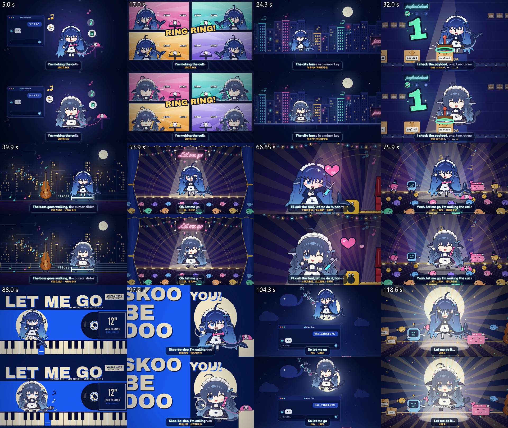

# Let Me Go · 大肥鱼代码动画 MV

用 Claude Opus 5.5 为《Let Me Go》制作的约 2 分钟动画 MV。角色、道具、场景与动作由 JavaScript / Canvas 绘制，使用 HyperFrames 编排与渲染。

仓库及视频发布均由 Codex GPT-6 Astra 负责。

**观看成片：[B站双版本 MV · BV1C7h16jEHJ](https://www.bilibili.com/video/BV1C7h16jEHJ/)**（UP 主：polaris0）。P1 为 V2 角色修订版，P2 为 V1 初版。


## 两个版本

| 版本 | 对应投稿 | 特点 |
| --- | --- | --- |
| [v2](v2/) | P1 · 角色修订版 | 重画了脸、比例、服装和鲸尾，更贴近熟悉的大肥鱼造型。 |
| [v1](v1/) | P2 · 初版 | 角色造型更特别，但制作者的观看评价是动作更流畅，原样保留。 |

两版均为 1920×1080、30fps，成片时长 124.466667 秒。



## 怎么做的

制作入口基本是一句需求，附上歌曲与角色方向后，由 Claude 完成分镜、动画指南、角色绘制、场景和代码。初版后根据角色反馈另做 v2。这里的“一句话”描述高层需求委托形式，不表示后续没有反馈或修订。

制作者已补充[两次实际制作输入](PROMPTS.md)：第一次提供工作流参考、歌曲和角色方向，第二次要求保存初版并修改角色。生成出的完整方案可看各版 `STORYBOARD.md` 与 `ANIMATION_GUIDE.md`。制作者提供的会话用量报告确认模型为 Opus 5.5。

会话报告四项合计约 **7,456万 tokens（含缓存读写）**，其中缓存读取约7,320万、输出约26.49万；墙钟时间93分钟。API 664m为时间项，Cost $200.49保留为报告口径，不等于实际额外付款。初版/改角色占比只有制作者的回忆，没有分阶段统计。完整原值与计算见[USAGE.md](USAGE.md)。

制作方法参考 [PDoomVideo](https://github.com/JohnHeibel/PDoomVideo)：先写分镜与动画指南，再按章节制作。按原工程说明，只借鉴方法，没有复制其角色、歌曲或代码资产。

## 工程里有什么

```text
v1/                       初版完整画面工程
v2/                       角色修订版完整画面工程
  src/cast.js             角色绘制与表情、动作接口
  src/props.js            舞台、电话、工具、城市等道具
  src/lib.js              共享绘图与时间工具
  src/song.js             节拍、章节时间与双语歌词数据
  compositions/ch1..9     九个章节
  tools/still.html        不依赖音乐的单章画面查看入口
  tools/build_index.py    从歌曲时间数据构建主时间线
docs/                     投稿封面与两版实际帧对照
LICENSES/                 第三方字体及运行库许可资料
```

源代码与章节 HTML 保持原工程内容。移出了歌曲文件、原作者参考图、应用缓存、测试候选图和已渲染视频。

## 先看画面

需要 Python 3。在仓库根目录运行：

```bash
python -m http.server 8765 --bind 127.0.0.1
```

浏览器打开以下两个地址，可以直接查看同一时刻的原始代码画面，不需要歌曲文件：

- `http://127.0.0.1:8765/v2/tools/still.html?ch=ch5&t=66.85`
- `http://127.0.0.1:8765/v1/tools/still.html?ch=ch5&t=66.85`

将 `ch=ch5` 换成其他章节，并将 `t` 换成该章节内的歌曲绝对时间。`sheet=auto` 可以查看一章的12帧对照。

## 带音乐预览和渲染

需要 Node.js 22+、FFmpeg，以及自己有权使用的原曲音轨。本包不提供歌曲下载或自动抓取。按 [MEDIA.md](MEDIA.md) 将音轨放到所选版本的 `assets/song.mp3`，然后：

```bash
cd v2
npx --yes hyperframes@0.8.72 preview --background
npx --yes hyperframes@0.8.72 preview --status
npm run check
```

检查与观看后，可在该版本目录运行：

```bash
npx --yes hyperframes@0.8.72 render . --fps 30 -o ./renders/let-me-go-v2.mp4
```

v1使用相同命令，切换到 `v1/` 即可。保留原工程的 HyperFrames 0.8.72 版本，以便复现原片；升级框架后应重新检查画面。Windows建议使用较短的项目路径，例如 `D:/mv/let-me-go`。

本地整理已核对68个复制文件的哈希、8个共享JS文件的语法，并通过原有单章查看入口逐一打开v1/v2各9章的中间时刻，18个画面均无运行错误。这不是重新渲染的发布版本，也不宣称去掉音轨后能直接通过完整音画检查。

## 署名与许可

- 歌曲：罐装毕加索《Let Me Go（共创版）》；[原投稿](https://www.bilibili.com/video/BV1XbY66nEWr/)。原作 @星落落_oi；词 DeepSeek；曲 Suno / 豆包，沿原投稿署名。
- 角色原型「溟月」：@上善无形；女仆鲸鱼娘设计：@ZipZipPipe。角色衍生内容沿原工程标注的 CC BY-NC-SA 4.0，保留署名、非商业和相同方式共享条件。
- 桌宠项目 [DeepSeek-Whale-Girl](https://github.com/GarfieldZhung/DeepSeek-Whale-Girl) 仅作参考来源；其 README 明确 MIT 不覆盖图片素材，本包不再分发这些参考图片。
- 封面是另用 imagegen 重绘的投稿包装；正片是代码动画。
- 本项目公开源码供查看与研究；除另有标注外，项目自有代码暂未授予通用开源许可证。第三方依赖、角色和歌曲的权利分开列在 [THIRD_PARTY_NOTICES.md](THIRD_PARTY_NOTICES.md)，不将整个仓库笼统标为MIT。

仓库名：`let-me-go-code-mv`。歌曲音轨与成片视频不随源码分发；成片请观看上方 B站链接。
